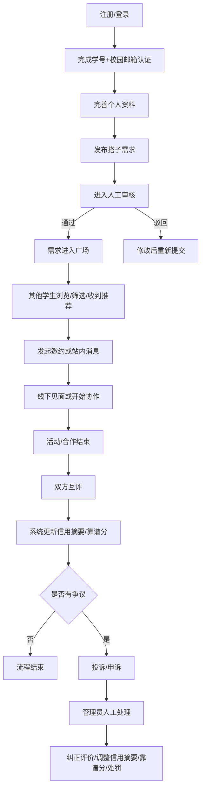

# 04 Product Design V1

这份文档用于承接《校园搭子平台需求分析报告》的最新需求基线，继续细化 `校园搭子` 第一版产品设计。

## 0. 文档状态

- 当前阶段：product design alignment
- 适用版本：`校园搭子` V1
- 输入基线：
  - `D:\big_homework\latex_work\build_pdf_hierarchy\main.pdf`
  - `D:\big_homework\latex_work\body.tex`
  - `D:\big_homework\docs\02_planning_spec.md`
- 本文目标：在不进入代码实现的前提下，明确 V1 产品边界、页面职责、流程闭环与后续原型承接关系。

### 0.1 与需求分析报告的统一口径

- 项目定位统一为“单校、软件端、轻量级校园搭子匹配平台”；当前页面与原型优先采用 Web 形态表达，但不把“纯 Web”写成产品本体定位。
- 需求层级以 `RR -> SF -> MOD/IR -> US -> FR/PAGE/UI/NFR` 的递进关系理解；本文仅承接产品设计，不替代需求分析报告中的编号基线。
- “信用摘要”为需求报告中的正式术语；原型与页面中可继续使用“靠谱分”作为面向学生的展示名，但文档叙述应优先写作“信用摘要/靠谱分”。
- “邀约”“双向确认”“站内消息”统一归入低压力联系机制；第一版不扩展为完整即时通讯系统。

### 0.2 技术形态修正说明

- 本文早期关于 Web 页面形态的表述仅作为历史原型表达保留。
- 根据 2026-05-14 详细设计技术约束确认，初版交付目标调整为 Win11 桌面 PC 软件。
- 后续详细设计与实现阶段以“桌面客户端 + 后端服务器 + 数据库 + 移动端 App 接入预留”为技术边界。

## 1. 设计边界

### 1.1 本文默认不再重复争议的已确认前提

- 产品是面向单校部署的软件端校园同伴匹配平台，当前设计以 Web 页面形态作为主要原型与实现载体
- 第一版覆盖 5 类场景：
  - 饭搭子
  - 学习搭子
  - 运动搭子
  - 小组作业队友
  - 大创项目队友
- 产品结构采用统一发布 / 匹配流程 + 场景化字段
- 匹配方式以广场筛选为主，系统规则推荐为辅
- 需要校园邮箱登录与学号等校内身份信息认证
- 需要低压力联系机制，包括邀约确认、站内消息与联系方式卡片
- 需要互评、信用摘要/靠谱分、申诉机制
- 需要管理端：内容审核、用户管理、信用摘要干预、投诉/申诉处理

### 1.2 第一版设计目标

- 让学生可以低社交压力地发布找搭子需求
- 让学生可以按条件高效筛选和联系合适同伴
- 让用户可信度在系统内形成可展示、可申诉、可干预的信用闭环
- 让管理员可以用人工审核方式先托住平台秩序

### 1.3 第一版明确不展开

- 不进入具体技术架构选型
- 不设计复杂推荐算法
- 不扩展跨校、多校运营模型
- 不把站内消息扩展为完整 IM 系统
- 不把积分商城、勋章体系作为 V1 范围

## 2. 用户故事

### 2.1 学生用户主故事

1. 作为一个在校学生，我希望先完成学号和校园邮箱认证，这样我能判断平台里的用户至少具备校内身份。
2. 作为一个想找搭子的学生，我希望按场景快速发布结构化需求，这样我不用反复在群里解释时间、地点和要求。
3. 作为一个发起人，我希望我的需求在审核通过后进入广场，这样能减少违规内容和无效信息。
4. 作为一个寻找搭子的学生，我希望按时间、地点、标签、技能、水平等条件筛选需求，这样能更快找到适合的人。
5. 作为一个社交压力较大的学生，我希望先通过邀约确认或站内消息沟通，再决定是否交换联系方式，这样不必一开始就暴露外部联系方式。
6. 作为一个对伙伴质量有要求的学生，我希望先看到对方认证状态、信用摘要/靠谱分和历史评价摘要，这样能降低试错成本。
7. 作为一个已经完成活动或合作的学生，我希望在结束后评价对方履约和协作情况，这样后续用户能参考。
8. 作为一个被误评或被误罚的学生，我希望提交证据发起申诉，这样不合理的评价或处罚可以被纠正。

### 2.2 五类场景补充故事

- 饭搭子：作为一个临近饭点想找人一起吃饭的学生，我希望快速找到同时间、同食堂、预算接近的人。
- 学习搭子：作为一个备考或自习的学生，我希望找到目标相近、作息相近、监督方式相容的人。
- 运动搭子：作为一个想运动的学生，我希望找到项目一致、水平接近、场地合适的人。
- 小组作业队友：作为一个需要组队的学生，我希望明确课程、截止时间、分工角色和投入预期，避免临时拉人和后续扯皮。
- 大创项目队友：作为一个发起项目的学生，我希望按方向、技能、角色和周期筛人，优先联系更靠谱的候选人。

### 2.3 管理员故事

1. 作为管理员，我希望审核新发布的搭子需求，这样广场里不会快速堆积违规或垃圾信息。
2. 作为管理员，我希望审核头像、昵称、个人资料和评价内容，这样能控制骚扰、冒充和攻击性内容。
3. 作为管理员，我希望查看投诉、申诉、证据和双方回应，这样能做出人工判断。
4. 作为管理员，我希望可以警告、禁言、封禁、调整信用摘要/靠谱分或纠正评价，这样能维持平台秩序。

## 3. 功能清单与优先级

### 3.1 P0 必须做

- 账号注册、登录、退出
- 校园邮箱登录与学号等校内身份信息认证
- 学生基础资料维护
- 统一发布需求
- 五类场景差异字段录入
- 搭子需求先审后发
- 广场浏览、搜索、筛选、排序
- 需求详情查看
- 系统规则推荐
- 站内消息
- 图片 / 截图发送
- 联系方式卡片发送
- 消息举报
- 活动 / 合作完成后的互评
- 信用摘要/靠谱分展示与变更记录
- 投诉 / 申诉提交
- 证据上传
- 被投诉方回应
- 管理端审核、投诉/申诉处理、用户管理、信用摘要干预

### 3.2 P1 应该做

- 我的发布状态追踪
- 私信中的快捷引用需求卡片
- 推荐理由展示
- 评价后的申诉进度追踪
- 管理端基础统计看板

### 3.3 P2 暂不做

- 一键闪约
- 匿名意向确认
- 已读、撤回、黑名单
- 复杂推荐算法
- 跨校匹配
- 积分商城 / 奖励体系

## 4. 页面清单与页面职责

### 4.1 学生端页面

1. `登录/注册页`
   - 账号登录
   - 校园邮箱验证码登录或注册
   - 进入学号绑定与认证流程
2. `身份认证页`
   - 填写学号、学校、学院、年级等基础信息
   - 发起校园邮箱验证
   - 查看认证状态和失败原因
3. `首页/广场页`
   - 浏览已审核通过的需求
   - 场景切换、筛选、搜索、排序
   - 查看系统推荐入口
4. `需求发布页`
   - 选择场景
   - 填写统一字段与场景差异字段
   - 提交审核
5. `需求详情页`
   - 展示需求内容、发起人基础信息、信用摘要/靠谱分摘要
   - 发起站内消息或邀约确认
   - 举报需求
6. `我的发布页`
   - 查看草稿、待审核、已发布、被驳回、已过期、已关闭的需求
   - 对驳回内容进行修改再提交
7. `消息列表页`
   - 查看会话列表
   - 查看未读消息概览
   - 进入私信会话
8. `站内消息会话页`
   - 发送文本、图片 / 截图、联系方式卡片
   - 举报消息
   - 关联查看对方资料和原始需求
9. `个人主页/资料页`
   - 维护昵称、头像、简介、标签
   - 查看认证状态、信用摘要/靠谱分、评价摘要
10. `评价页`
   - 对已结束的活动或合作进行互评
   - 按场景选择评价维度
11. `投诉/申诉页`
   - 发起投诉或申诉
   - 上传证据
   - 查看处理进度与结果
12. `通知页`
   - 接收审核结果、私信提醒、评价提醒、申诉处理通知

### 4.2 管理端页面

1. `管理员登录页`
2. `审核工作台`
   - 审核搭子需求
   - 审核资料、头像、昵称、评价内容
3. `投诉/申诉处理页`
   - 查看案件详情、证据、双方回应
   - 输出处理结果
4. `用户管理页`
   - 查看认证信息、用户状态、历史处罚
   - 执行警告、禁言、封禁
5. `信用摘要/靠谱分干预页`
   - 查看分数变更记录
   - 手动调整分数并填写原因
6. `基础数据看板`
   - 查看待审核量、待处理投诉量、活跃场景分布等基础指标

## 5. 核心流程

### 5.1 学生主流程

### 5.2 发布审核流程说明

1. 学生提交需求后，内容状态进入 `待审核`。
2. 管理员检查是否存在违规、骚扰、广告、虚假信息、明显缺失字段。
3. 审核通过后需求进入广场并参与推荐。
4. 审核驳回后，用户可查看原因并修改重新提交。
5. 已发布需求到达有效期后自动过期，用户也可主动关闭。

### 5.3 低压力联系与达成联系流程说明

1. 学生从需求详情发起邀约或站内消息。
2. 会话默认绑定一条原始需求，便于双方理解上下文。
3. 双方在站内沟通是否匹配，可发送文本、截图和联系方式卡片。
4. 若一方发送骚扰、广告或违规内容，另一方可直接举报消息。
5. 一旦线下见面或开始合作，系统记录该次联系进入后续评价候选。

### 5.4 评价与信用摘要流程说明

1. 活动或合作结束后，系统提醒双方互评。
2. 评价按场景带入不同维度：
   - 通用：是否守时、是否失联、沟通是否顺畅
   - 协作类：是否按时交付、是否承担约定任务
3. 系统按规则更新信用摘要/靠谱分，并记录原因。
4. 如果评价涉及明显争议，被评价方可发起申诉。

### 5.5 投诉 / 申诉流程说明

1. 用户选择投诉对象或申诉对象，填写说明并上传证据。
2. 系统通知被投诉方可补充回应。
3. 管理员查看案件、证据和历史记录后人工裁定。
4. 处理结果包括：不处理、删除 / 纠正评价、扣减 / 恢复信用摘要/靠谱分、警告、临时禁言、封禁。
5. 处理结果写入通知与后台日志，供后续追踪。

## 6. 数据对象草案

以下为产品设计视角的数据对象，不等同于最终数据库设计。

### 6.1 用户与身份对象

#### `School`

- `school_id`
- `school_name`
- `status`

#### `User`

- `user_id`
- `school_id`
- `account_status`
- `role`
- `student_no`
- `campus_email`
- `email_verified`
- `realname_verified`
- `reliability_score`
- `created_at`

#### `UserProfile`

- `user_id`
- `nickname`
- `avatar`
- `gender`
- `college`
- `grade`
- `bio`
- `tags`
- `profile_review_status`

### 6.2 搭子需求对象

#### `PartnerPost`

- `post_id`
- `school_id`
- `creator_user_id`
- `scene_type`
- `title`
- `summary`
- `time_text`
- `start_time`
- `end_time`
- `location_text`
- `participant_count`
- `gender_preference`
- `expectation_tags`
- `expires_at`
- `post_status`
- `review_status`
- `reject_reason`
- `created_at`

#### `PartnerPostSceneExtra`

- `post_id`
- `scene_type`
- `extra_payload`

说明：
- `extra_payload` 用于承接 5 类场景差异字段
- 第一版建议保持统一需求主对象 + 场景扩展对象，不在产品层拆成 5 套对象体系

### 6.3 匹配与沟通对象

#### `Conversation`

- `conversation_id`
- `school_id`
- `related_post_id`
- `initiator_user_id`
- `receiver_user_id`
- `conversation_status`
- `created_at`

#### `Message`

- `message_id`
- `conversation_id`
- `sender_user_id`
- `message_type`
- `text_content`
- `media_url`
- `contact_card_payload`
- `sent_at`
- `report_status`

#### `RecommendationRecord`

- `recommendation_id`
- `target_user_id`
- `post_id`
- `scene_match_score`
- `time_match_score`
- `location_match_score`
- `tag_match_score`
- `reliability_weight`
- `final_rank_score`
- `generated_at`

### 6.4 信用与治理对象

#### `Review`

- `review_id`
- `school_id`
- `scene_type`
- `related_post_id`
- `reviewer_user_id`
- `reviewee_user_id`
- `rating_result`
- `review_tags`
- `comment_text`
- `review_status`
- `created_at`

#### `ReliabilityScoreLog`

- `log_id`
- `user_id`
- `change_type`
- `change_value`
- `reason_code`
- `related_review_id`
- `related_case_id`
- `operator_type`
- `created_at`

#### `CaseTicket`

- `case_id`
- `school_id`
- `case_type`
- `applicant_user_id`
- `target_user_id`
- `related_post_id`
- `related_review_id`
- `related_message_id`
- `description`
- `evidence_list`
- `case_status`
- `response_deadline`
- `decision_result`
- `decision_note`
- `created_at`
- `closed_at`

#### `CaseResponse`

- `response_id`
- `case_id`
- `responder_user_id`
- `response_text`
- `evidence_list`
- `created_at`

#### `ModerationRecord`

- `record_id`
- `target_type`
- `target_id`
- `moderator_user_id`
- `action_type`
- `action_reason`
- `created_at`

## 7. 接口边界草案

以下是产品级接口边界，目的是为后续 execution 线程划清模块，不是最终 API 定义。

### 7.1 认证与账号域

- `注册/登录`
  - 输入：邮箱、验证码或登录凭证
  - 输出：登录态、用户基础信息、是否已认证
- `提交学号与校园邮箱认证`
  - 输入：学号、校园邮箱、学校信息
  - 输出：认证状态、失败原因
- `获取当前用户资料`
- `更新用户资料`

### 7.2 搭子需求域

- `创建需求`
  - 输入：统一字段 + 场景字段
  - 输出：需求 ID、审核状态
- `更新需求`
- `关闭需求`
- `获取我的需求列表`
- `获取广场需求列表`
  - 输入：场景、时间、地点、标签、排序条件
  - 输出：需求卡片列表、分页信息
- `获取需求详情`
- `举报需求`

### 7.3 推荐域

- `获取推荐需求列表`
  - 输入：当前用户上下文
  - 输出：推荐需求、推荐理由摘要

### 7.4 站内消息与联系域

- `创建或打开会话`
- `获取会话列表`
- `获取消息列表`
- `发送文本消息`
- `发送图片消息`
- `发送联系方式卡片`
- `举报消息`

### 7.5 评价与信用摘要域

- `获取待评价对象列表`
- `提交评价`
- `获取用户评价摘要`
- `获取信用摘要/靠谱分与分数变更记录`

### 7.6 投诉 / 申诉域

- `创建投诉`
- `创建申诉`
- `上传证据`
- `提交案件回应`
- `获取我的案件列表`
- `获取案件详情`

### 7.7 管理端域

- `获取待审核列表`
- `审核通过/驳回需求`
- `审核资料或评价内容`
- `获取投诉/申诉案件列表`
- `处理案件`
- `获取用户详情与历史处理记录`
- `执行警告/禁言/封禁`
- `手动调整信用摘要/靠谱分`

## 8. 验证计划

### 8.1 本阶段验证目标

- 验证这套 V1 产品设计是否覆盖 5 类场景的共同骨架
- 验证学生端核心闭环是否顺畅：认证 -> 发布 -> 审核 -> 浏览/推荐 -> 邀约或站内消息 -> 互评 -> 申诉
- 验证管理员是否能用可接受的人力成本维持平台秩序

### 8.2 设计评审清单

1. 每个已确认需求是否都能在页面和流程中找到落点
2. 是否存在明显缺失状态，例如驳回、过期、关闭、申诉中
3. 五类场景是否都能被统一字段 + 差异字段覆盖
4. 学生和管理员职责边界是否清晰
5. 是否有明显超出 V1 的设计膨胀

### 8.3 用户验证建议

1. 找 5 到 8 名真实学生做任务走查
   - 任务 A：发布一条饭搭子需求
   - 任务 B：筛选一条学习搭子需求并发起私信
   - 任务 C：模拟对一次失约行为进行评价
   - 任务 D：模拟发起一条申诉
2. 找 1 到 2 名具备管理视角的同学或助教试走审核与案件处理流程
3. 重点记录：
   - 哪一步最卡
   - 哪些字段最难填
   - 哪些规则最不容易理解

### 8.4 原型或后续实现前的验收标准

- 用户能在 3 分钟内完成一条需求发布
- 用户能在 1 分钟内理解广场筛选条件
- 用户能理解信用摘要/靠谱分并知道其来源
- 用户能找到投诉 / 申诉入口
- 管理员能独立处理一条需求审核和一条申诉案件

### 8.5 业务结果验证指标

以下指标承接 PPT 口径，建议作为 V1 内测目标，而不是当前线程的完成标准：

- 匹配成功率 >= 60%
- 周活跃用户使用频次 >= 3 次
- 用户满意度 >= 4/5

## 9. 下一阶段建议

基于当前详细产品设计，下一阶段更适合继续拆成以下方向之一：

1. `原型/信息架构线程`
   - 输出学生端与管理端低保真原型、页面跳转关系、字段呈现方式
2. `execution 准备线程`
   - 输出模块拆分、开发顺序、接口草案细化、状态机补完
3. `验证设计线程`
   - 输出访谈脚本、可用性测试任务单、内测记录模板

## 10. 原型承接文档

- 基于本文继续细化的原型与信息架构文档已落盘至：
  - `D:\big_homework\docs\05_prototype_ia_v1.md`
- 后续若继续做页面评审、交互确认或高保真原型，应优先承接该文档，而不是回退重写本文件中的产品边界
- 基于本文与原型文档继续收敛的 execution 准备文档已落盘至：
  - `D:\big_homework\docs\06_execution_preparation_v1.md`

## 11. 2026-05-14 对齐记录

- 将产品定位从“纯 Web 校园同伴匹配系统”调整为“单校、软件端、轻量级校园搭子匹配平台”，Web 仅作为当前原型与执行载体。
- 将“站内私信”统一收敛为“低压力联系机制”，覆盖邀约确认、站内消息与联系方式卡片，不扩展为完整 IM。
- 将“信用分/靠谱分”统一为“信用摘要/靠谱分”，与需求分析报告中的正式术语保持一致。
- 明确本文承接最新 LaTeX 版需求分析报告，不再仅承接早期 planning 文档。
