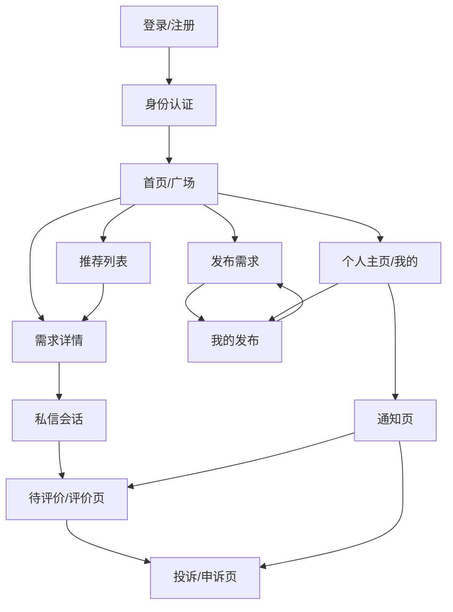
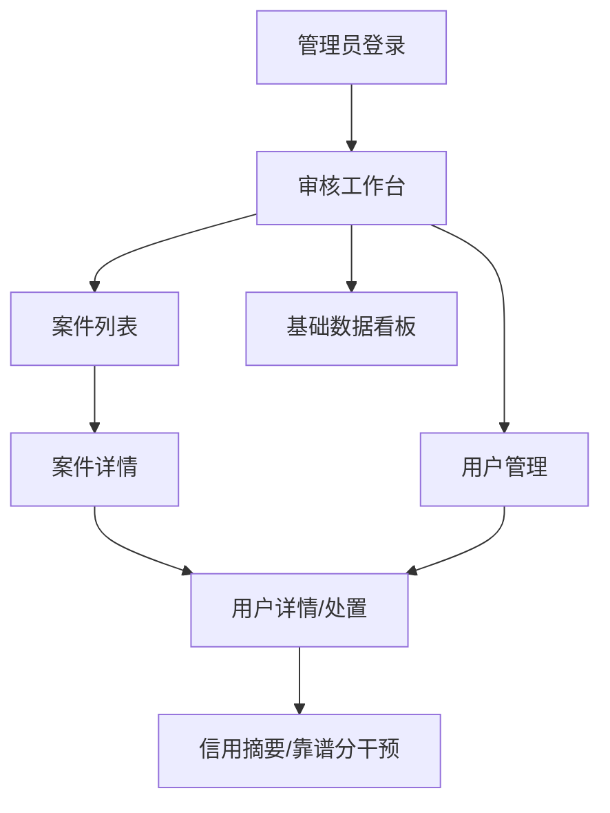

# 05 Prototype IA V1

这份文档用于承接《校园搭子平台需求分析报告》与 `docs/04_product_design_v1.md` 的统一口径，继续细化 `校园搭子` 第一版原型设计与信息架构。

## 0. 文档状态

- 当前阶段：prototype / information architecture
- 适用版本：`校园搭子` V1
- 输入基线：
  - `D:\big_homework\latex_work\build_pdf_hierarchy\main.pdf`
  - `D:\big_homework\latex_work\body.tex`
  - `D:\big_homework\docs\02_planning_spec.md`
  - `D:\big_homework\docs\04_product_design_v1.md`
- 本文目标：在不进入代码实现的前提下，形成可直接用于低保真原型、页面评审和后续执行拆分的页面骨架。

### 0.1 与需求分析报告的统一口径

- 项目定位统一为“单校、软件端、轻量级校园搭子匹配平台”；本文以 Web 页面线框表达原型，不将“纯 Web”作为产品定位本身。
- “信用摘要”为正式术语；页面可使用“靠谱分”作为展示名，文档叙述统一写作“信用摘要/靠谱分”。
- “邀约确认”“站内消息”“联系方式卡片”统一归入低压力联系机制；本文不设计完整 IM。
- 页面编号与交互编号应服务于需求报告中的 `FR/PAGE/UI` 追踪关系，不重新定义需求层级。

### 0.2 技术形态修正说明

- 本文早期线框以 Web 页面表达，是历史原型表达方式，不再代表当前技术交付形态。
- 根据 2026-05-14 详细设计技术约束确认，初版交付目标为 Win11 桌面 PC 软件。
- 后续原型若继续使用页面线框，应理解为桌面客户端界面草图，而不是 Web 端交付承诺。

## 1. 原型设计边界

### 1.1 本文默认继承的已确认前提

- 产品为面向单校部署的软件端校园同伴匹配平台，当前原型以 Web 页面表达
- 第一版覆盖 5 类场景：饭搭子、学习搭子、运动搭子、小组作业队友、大创项目队友
- 产品结构采用统一发布 / 匹配流程 + 场景化字段
- 匹配方式以广场筛选为主，规则推荐为辅
- 学生侧必须包含校园邮箱登录与校内身份认证、低压力联系机制、互评、信用摘要/靠谱分、投诉 / 申诉
- 管理侧必须覆盖内容审核、用户管理、信用摘要干预、投诉 / 申诉处理

### 1.2 本文输出范围

- 页面信息架构
- 学生端关键页面低保真线框
- 管理端关键页面低保真线框
- 字段呈现方式与核心交互说明
- 页面跳转关系
- 待确认交互决策点

### 1.3 本文明确不做

- 不进入前端实现或组件拆分
- 不细化数据库表结构和技术架构
- 不推翻已确认的业务边界
- 不做高保真视觉稿

## 2. 页面信息架构

### 2.1 学生端 IA 总览

学生端建议按 5 个信息分区组织，而不是按功能散落：

1. 准入区
   - 登录 / 注册
   - 身份认证
2. 发现区
   - 首页 / 广场
   - 推荐列表
   - 需求详情
3. 交易区
   - 发布需求
   - 我的发布
   - 消息列表
   - 私信会话
4. 信用治理区
   - 评价入口
   - 投诉 / 申诉
   - 通知中心
5. 个人中心区
   - 个人主页 / 资料
   - 信用摘要/靠谱分与评价摘要
   - 认证状态

### 2.2 学生端页面层级

```text
学生端
├─ A. 准入
│  ├─ A1 登录/注册
│  └─ A2 身份认证
├─ B. 发现
│  ├─ B1 首页/广场
│  ├─ B2 推荐列表
│  └─ B3 需求详情
├─ C. 交易
│  ├─ C1 发布需求
│  ├─ C2 我的发布
│  ├─ C3 消息列表
│  └─ C4 私信会话
├─ D. 信用治理
│  ├─ D1 评价页
│  ├─ D2 投诉/申诉提交页
│  └─ D3 通知页
└─ E. 个人中心
   └─ E1 个人主页/资料页
```

### 2.3 管理端 IA 总览

管理端建议以“待处理工作”而不是“后台功能目录”为核心组织方式：

1. 审核工作区
   - 待审核需求
   - 待审核资料 / 头像 / 昵称 / 评价
2. 案件工作区
   - 投诉 / 申诉列表
   - 案件详情与处理
3. 用户治理区
   - 用户检索
   - 用户详情
   - 状态处置
4. 信用干预区
   - 信用摘要/靠谱分变更记录
   - 手动分值调整
5. 运营概览区
   - 基础数据看板

### 2.4 管理端页面层级

```text
管理端
├─ M1 管理员登录
├─ M2 审核工作台
├─ M3 投诉/申诉处理列表
├─ M4 案件详情页
├─ M5 用户管理页
├─ M6 用户详情/处置页
├─ M7 信用摘要/靠谱分干预页
└─ M8 基础数据看板
```

## 3. 页面导航骨架

### 3.1 学生端主导航建议

第一版建议采用底部 4 主导航 + 顶部情境操作：

- `广场`：发现搭子需求、筛选、推荐
- `发布`：发起新需求，进入统一发布流程
- `消息`：会话列表、未处理沟通
- `我的`：资料、认证、我的发布、信用摘要/靠谱分、投诉 / 申诉

补充规则：

- `通知` 不独立做底部主导航，作为右上角入口进入
- `推荐` 不单独占底部导航，作为广场页内的分区或二级 tab
- `评价入口` 不常驻主导航，从通知、我的页面或任务卡片进入

### 3.2 管理端主导航建议

第一版建议左侧导航固定为：

- `审核工作台`
- `案件处理`
- `用户管理`
- `信用摘要/靠谱分干预`
- `数据看板`

每个一级导航均显示待处理数量，优先引导管理员处理积压事项。

## 4. 学生端关键页面线框

### 4.1 登录 / 注册页

```text
+--------------------------------------------------+
| 校园搭子 Logo                         帮助/规则   |
|--------------------------------------------------|
| 标题：先完成校内身份验证，再开始找搭子           |
| 副文案：仅支持本校学生使用                        |
|                                                  |
| [校园邮箱] _____________________________         |
| [验证码]   ____________ [发送验证码]             |
|                                                  |
| [登录 / 注册]                                    |
|                                                  |
| 说明：首次登录后需补充学号与个人资料              |
| 常见问题：为什么需要认证？                        |
+--------------------------------------------------+
```

交互说明：

- 默认单入口，不区分“登录”和“注册”两套表单
- 校园邮箱通过验证码完成账号准入
- 登录成功后若未完成认证，强制跳转身份认证页

### 4.2 身份认证页

```text
+--------------------------------------------------+
| 返回                              认证状态：待完成 |
|--------------------------------------------------|
| 步骤 1/2：校内身份认证                           |
|                                                  |
| 学号        [________________]                   |
| 学校        [本校名称，不可改]                   |
| 学院        [________________]                   |
| 年级        [大一 v]                             |
| 昵称        [________________]                   |
|                                                  |
| 校园邮箱    user@school.edu.cn [已验证]          |
|                                                  |
| [提交认证资料]                                   |
|                                                  |
| 认证说明：                                       |
| - 学号 + 校园邮箱用于校内身份确认                 |
| - 昵称/头像/简介后续仍需通过资料审核              |
+--------------------------------------------------+
```

交互说明：

- 学校字段默认锁定单校场景
- 昵称可提前填写，但最终是否公开受资料审核状态影响
- 若认证驳回，需要展示驳回原因并支持修改后再次提交

### 4.3 首页 / 广场页

```text
+--------------------------------------------------------------+
| 顶栏：校园搭子 | 搜索框 | 通知(3)                            |
|--------------------------------------------------------------|
| 场景 Tab: [全部] [饭搭子] [学习] [运动] [小组作业] [大创]     |
|--------------------------------------------------------------|
| 筛选条                                                    |
| 时间 [今天下午 v] 地点 [图书馆 v] 性别 [不限 v] 排序 [推荐 v]|
| 更多筛选 [标签/技能/水平]                                   |
|--------------------------------------------------------------|
| 推荐分区                                                     |
| 为你推荐 3 条：显示推荐理由摘要                              |
| [查看全部推荐]                                               |
|--------------------------------------------------------------|
| 广场列表                                                     |
| 卡片1 标题 + 场景 + 时间地点 + 人数 + 发起人信用摘要/靠谱分 |
|      标签 + 状态 + [查看详情]                                |
| 卡片2 ...                                                    |
|--------------------------------------------------------------|
| 底部导航：广场 | 发布 | 消息 | 我的                          |
+--------------------------------------------------------------+
```

交互说明：

- 顶部场景切换决定列表语境，筛选项在各场景下尽量保持一致位置
- `推荐分区` 放在列表上方，避免与广场形成两套并列产品
- 列表卡片必须同时露出“场景、时间、地点、信用摘要/靠谱分、状态”这 5 个决策字段
- 审核中、已过期、已关闭的内容不进入公开广场

### 4.4 统一发布页

```text
+--------------------------------------------------------------+
| 返回                         发布需求                         |
|--------------------------------------------------------------|
| 步骤条：1 选择场景 -> 2 填写信息 -> 3 确认提交               |
|--------------------------------------------------------------|
| 1. 场景类型                                                   |
| [饭搭子] [学习搭子] [运动搭子] [小组作业] [大创项目]         |
|--------------------------------------------------------------|
| 2. 公共字段                                                   |
| 标题            [________________________]                   |
| 简短说明        [________________________]                   |
| 时间/时间段      [________________________]                   |
| 地点            [________________________]                   |
| 人数            [__]                                         |
| 性别偏好        [不限 v]                                     |
| 期望条件/标签    [标签选择器]                                |
| 有效期          [明天 22:00 v]                               |
|--------------------------------------------------------------|
| 3. 场景字段（随场景变化）                                     |
| 例：学习搭子                                                 |
| 学习目标        [考研数学 / 期末复习...]                     |
| 作息节奏        [早起型 v]                                   |
| 监督方式        [打卡监督 v]                                 |
|--------------------------------------------------------------|
| [保存草稿]                            [提交审核]              |
+--------------------------------------------------------------+
```

交互说明：

- 统一发布页采用 3 步分步表单：选择场景、填写信息、确认提交；同一套表单承接 5 类场景，避免拆成 5 套彼此割裂的页面
- 场景切换时先提醒“已填字段是否清空”，避免误操作
- `保存草稿` 建议保留，降低长表单中断损失
- 提交后默认状态进入 `待审核`

### 4.5 需求详情页

```text
+--------------------------------------------------------------+
| 返回                     需求详情                             |
|--------------------------------------------------------------|
| 标题：周三晚图书馆自习搭子                                    |
| 标签：学习搭子 / 明晚 / 图书馆 / 2人                          |
| 状态：招募中                                                  |
|--------------------------------------------------------------|
| 发起人卡片                                                    |
| 头像 昵称(已认证) 学院年级                                    |
| 信用摘要/靠谱分：96 | 评价摘要：守时、沟通顺畅                    |
|--------------------------------------------------------------|
| 需求内容                                                      |
| 简短说明：...                                                 |
| 时间：...                                                     |
| 地点：...                                                     |
| 公共字段：人数 / 性别偏好 / 标签                              |
| 场景字段：学习目标 / 作息节奏 / 监督方式                      |
|--------------------------------------------------------------|
| 操作区                                                        |
| [发私信] [举报需求]                                           |
|--------------------------------------------------------------|
| 温馨提示：线下见面请注意安全，谨慎交换个人联系方式             |
+--------------------------------------------------------------+
```

交互说明：

- 详情页应把“发起人可信度信息”固定置顶，减少用户来回跳
- 不展示过多历史数据，只展示评价摘要与信用摘要/靠谱分来源提示
- 若当前用户未认证，点击 `发私信` 先引导完成认证

### 4.6 我的发布页

```text
+--------------------------------------------------------------+
| 我的发布                                  [新建需求]          |
|--------------------------------------------------------------|
| 状态 Tab: [全部] [草稿] [待审核] [已发布] [已驳回] [已关闭]   |
|--------------------------------------------------------------|
| 卡片1：学习搭子 / 待审核                                     |
| 标题 + 创建时间 + 最近处理状态                               |
| [查看] [编辑]                                                |
|--------------------------------------------------------------|
| 卡片2：运动搭子 / 已驳回                                     |
| 驳回原因摘要：时间信息不完整                                 |
| [查看原因] [修改后重提]                                      |
+--------------------------------------------------------------+
```

交互说明：

- `待审核` 和 `已驳回` 需要明确占位，避免用户误以为内容丢失
- 驳回原因必须能直接回流到编辑页，不要求用户自行重填全表单

状态文案补充：

- `待审核`
  - 状态标签：`待审核`
  - 主提示：`已提交，等待管理员审核`
  - 辅助说明：`审核通过后会进入广场展示，通常按提交顺序处理。`
  - 页面动作：`查看详情`
- `已驳回`
  - 状态标签：`已驳回`
  - 主提示：`本条需求未通过审核`
  - 辅助说明：`请根据驳回原因修改后重新提交。`
  - 页面动作：`查看原因`、`修改后重提`
- `已发布`
  - 状态标签：`招募中`
  - 主提示：`你的需求已进入广场`
  - 辅助说明：`其他同学现在可以看到并向你发起私信。`
  - 页面动作：`查看详情`
- `已关闭`
  - 状态标签：`已关闭`
  - 主提示：`该需求已结束招募`
  - 辅助说明：`关闭后的需求不会继续在广场中展示。`
- `已过期`
  - 状态标签：`已过期`
  - 主提示：`该需求已超过有效期`
  - 辅助说明：`如仍需要找搭子，建议复制内容后重新发布。`
  - 页面动作：`再次发布`

### 4.7 消息列表 / 私信会话页

```text
+--------------------------------------------------------------+
| 消息                                           筛选：全部会话 |
|--------------------------------------------------------------|
| 会话卡片                                                      |
| 用户头像 昵称            未读2                               |
| 关联需求：周三晚图书馆自习搭子                                |
| 最近消息摘要...                                               |
|--------------------------------------------------------------|
| 会话卡片2 ...                                                 |
|--------------------------------------------------------------|
| 底部导航：广场 | 发布 | 消息 | 我的                          |
+--------------------------------------------------------------+
```

```text
+--------------------------------------------------------------+
| 返回   对方昵称                     查看需求 | 举报            |
|--------------------------------------------------------------|
| 关联需求卡片：周三晚图书馆自习搭子                            |
|--------------------------------------------------------------|
| 时间轴消息区                                                  |
| 对方：你好，想问下你一般几点到图书馆？                        |
| 我方：大概 7 点                                               |
| 对方：[联系方式卡片]                                          |
|--------------------------------------------------------------|
| [输入文本...] [图片] [联系方式卡片] [发送]                    |
+--------------------------------------------------------------+
```

交互说明：

- 会话必须绑定原始需求卡片，减少“这是谁、因为什么联系我”的理解成本
- 输入区只保留 3 类发送能力：文本、图片、联系方式卡片
- 举报入口保留在会话页右上角，不放在输入区避免误触

状态文案补充：

- `联系方式未解锁`
  - 按钮状态：`联系方式卡片` 置灰
  - 主提示：`互相发送消息后可交换联系方式`
  - 辅助说明：`为减少骚扰与误发，双方各发送 1 条有效消息后自动解锁。`
- `联系方式已解锁`
  - 主提示：`已可发送联系方式卡片`
  - 辅助说明：`请确认沟通意向后再交换外部联系方式。`
- `消息已举报`
  - 轻提示：`已提交举报，管理员将人工核查`
  - 辅助说明：`举报不会立即通知对方，请补充必要截图与说明。`

### 4.8 我的页 / 个人主页

```text
+--------------------------------------------------------------+
| 我的                                                          |
|--------------------------------------------------------------|
| 头像 昵称                                                     |
| 已完成校内认证 | 信用摘要/靠谱分 96                          |
| 评价摘要：守时 / 回复快 / 合作清晰                            |
|--------------------------------------------------------------|
| 我的服务                                                      |
| [我的发布] [我的消息] [待评价] [投诉/申诉]                    |
|--------------------------------------------------------------|
| 资料与状态                                                    |
| [编辑资料] [认证状态] [信用摘要/靠谱分明细] [通知中心]        |
|--------------------------------------------------------------|
| 平台规则                                                      |
| [社区规范] [审核说明] [申诉说明]                              |
+--------------------------------------------------------------+
```

交互说明：

- 第一版个人页核心不是“展示个性”，而是“管理自己的交易状态和信用状态”
- `待评价` 需要单独突出，否则互评闭环容易断

状态文案补充：

- `待评价`
  - 卡片标题：`还有待完成评价`
  - 主提示：`请在截止前完成本次互评`
- 辅助说明：`评价将影响信用摘要/靠谱分记录，也会帮助其他同学判断合作体验。`
  - 页面动作：`去评价`
- `已过期未评`
  - 卡片标题：`本次评价已过期`
  - 主提示：`你未在规定时间内完成评价`
  - 辅助说明：`该次评价入口已关闭，不会再计入本次互评。`
  - 页面动作：`查看规则`
- `认证待审核`
  - 主提示：`身份资料已提交，等待审核`
  - 辅助说明：`审核期间可先浏览页面，但部分功能可能受限。`
- `认证已驳回`
  - 主提示：`认证资料未通过审核`
  - 辅助说明：`请根据驳回原因修改后重新提交。`
  - 页面动作：`重新提交`
- `案件处理中`
  - 主提示：`你的投诉/申诉正在处理中`
  - 辅助说明：`管理员会结合双方说明与证据进行人工判断，请耐心等待通知结果。`
  - 页面动作：`查看进度`

### 4.9 投诉 / 申诉提交页

```text
+--------------------------------------------------------------+
| 返回                     投诉 / 申诉                          |
|--------------------------------------------------------------|
| 类型 [投诉他人 v / 申诉处理结果 v / 申诉评价 v]              |
| 关联对象 [选择需求/评价/消息/用户]                            |
| 原因说明 [____________________________________________]      |
| 证据上传 [图片/截图/说明材料]                                 |
|--------------------------------------------------------------|
| 提交后：                                                       |
| - 管理员人工处理                                               |
| - 被投诉方可收到回应通知                                       |
| - 处理结果会写入通知中心                                       |
|--------------------------------------------------------------|
| [提交]                                                        |
+--------------------------------------------------------------+
```

交互说明：

- `投诉` 与 `申诉` 合并入口，但首字段必须先区分类型
- 关联对象尽量预带入，减少用户从零解释上下文

状态文案补充：

- `举报已提交`
  - 主提示：`举报已提交`
  - 辅助说明：`管理员将结合消息内容和补充材料进行核查。`
  - 页面动作：`补充说明`
- `案件处理中`
  - 状态标签：`处理中`
  - 主提示：`你的案件已进入人工处理`
  - 辅助说明：`处理期间可补充证据，也请留意对方回应和通知结果。`
  - 页面动作：`查看进度`

## 5. 管理端关键页面线框

### 5.1 审核工作台

```text
+----------------------------------------------------------------+
| 顶栏：管理员 | 本日待处理 18                                   |
|----------------------------------------------------------------|
| 左侧导航                                                        |
| 审核工作台(12)                                                  |
| 案件处理(4)                                                     |
| 用户管理                                                        |
| 信用摘要/靠谱分干预                                             |
| 数据看板                                                        |
|----------------------------------------------------------------|
| 内容类型 Tab：[需求] [资料] [头像昵称] [评价]                  |
| 筛选：提交时间 / 场景 / 风险级别                               |
|----------------------------------------------------------------|
| 列表                                                            |
| 记录1 标题/用户/场景/提交时间                                   |
| 风险提示：联系方式外露                                          |
| [查看详情] [通过] [驳回]                                        |
+----------------------------------------------------------------+
```

交互说明：

- 审核工作台首页优先展示“待处理队列”，不是数据概览
- `通过` 和 `驳回` 可在列表快捷操作，但仍需进入详情补全原因

状态文案补充：

- `待审核需求`
  - 状态标签：`待审核`
  - 主提示：`等待管理员处理`
  - 辅助说明：`优先查看时间敏感或风险提示较高的内容。`
- `已驳回需求`
  - 状态标签：`已驳回`
  - 主提示：`已退回用户修改`
  - 辅助说明：`驳回原因会同步给学生端，用于重新提交。`
- `高风险优先处理`
  - 摘要提示：`检测到高风险内容，请优先核查`
  - 辅助说明：`例如外露联系方式、攻击性内容、明显违规信息。`

### 5.2 案件详情页

```text
+----------------------------------------------------------------+
| 返回                    案件详情 #CASE-1024                    |
|----------------------------------------------------------------|
| 案件信息：投诉类型 / 当前状态 / 申请人 / 被投诉方 / 提交时间    |
|----------------------------------------------------------------|
| 关联对象                                                        |
| 需求卡片 / 评价内容 / 消息截图 / 用户信息                       |
|----------------------------------------------------------------|
| 证据区                                                          |
| 申请人说明                                                      |
| 附件1、附件2                                                    |
|----------------------------------------------------------------|
| 被投诉方回应                                                    |
| 回应内容 / 补充证据                                             |
|----------------------------------------------------------------|
| 处理动作                                                        |
| [不处理] [删除/纠正评价] [扣减信用摘要/靠谱分] [恢复信用摘要/靠谱分] |
| [警告] [临时禁言] [封禁]                                        |
| 处理备注 [____________________________________]                |
| [提交处理结果]                                                  |
+----------------------------------------------------------------+
```

交互说明：

- 管理端必须在同一页看到“原始对象、双方证据、可执行动作”
- 处理动作与处理备注应强绑定，保证后续可追溯

状态文案补充：

- `案件处理中`
  - 状态标签：`处理中`
  - 主提示：`案件等待人工判断`
  - 辅助说明：`请优先核对证据完整性、双方回应和关联历史记录。`
- `待补证据`
  - 状态标签：`待补证据`
  - 主提示：`当前证据不足`
  - 辅助说明：`请通知申请人或被投诉方补充截图、说明或其他证明材料。`

### 5.3 用户管理 / 用户详情页

```text
+----------------------------------------------------------------+
| 用户管理                                                        |
|----------------------------------------------------------------|
| 搜索：昵称/学号/邮箱                                            |
| 筛选：认证状态 / 账号状态 / 信用摘要/靠谱分区间                |
|----------------------------------------------------------------|
| 用户列表                                                        |
| 昵称 | 学号 | 认证状态 | 信用摘要/靠谱分 | 最近处罚 | [查看详情] |
+----------------------------------------------------------------+
```

```text
+----------------------------------------------------------------+
| 返回                    用户详情                                |
|----------------------------------------------------------------|
| 基础信息：昵称 / 学号 / 学院 / 年级 / 校园邮箱                  |
| 状态信息：认证状态 / 账号状态 / 信用摘要/靠谱分                |
|----------------------------------------------------------------|
| 历史记录                                                        |
| 发布记录 / 被举报记录 / 处罚记录 / 信用摘要/靠谱分变动         |
|----------------------------------------------------------------|
| 操作区                                                          |
| [警告] [临时禁言] [封禁] [恢复账号]                             |
| [调整信用摘要/靠谱分]                                           |
+----------------------------------------------------------------+
```

交互说明：

- 用户详情页承担“治理总览”角色，不仅是资料页
- 列表页尽量只做检索与筛选，重操作进入详情页完成

### 5.4 信用摘要/靠谱分干预页

```text
+----------------------------------------------------------------+
| 信用摘要/靠谱分干预                                             |
|----------------------------------------------------------------|
| 搜索用户 [__________]                                           |
|----------------------------------------------------------------|
| 当前分数：96                                                    |
| 近期变动记录                                                    |
| +2 正常履约                                                     |
| -8 迟到                                                         |
|----------------------------------------------------------------|
| 手动调整                                                        |
| 调整值 [ + / - __ ]                                             |
| 原因分类 [申诉纠正 v]                                           |
| 备注 [________________________]                                |
| [提交调整]                                                      |
+----------------------------------------------------------------+
```

交互说明：

- 手动干预页不建议直接暴露在案件页外层完成全部动作，应作为补充操作页保留完整日志

## 6. 字段呈现与交互说明

### 6.1 广场卡片最小字段集

广场列表卡片至少展示：

- 场景类型
- 标题
- 时间
- 地点
- 人数
- 标签摘要
- 发起人昵称
- 认证状态
- 信用摘要/靠谱分
- 当前状态

设计原则：

- 先展示“是否值得点进去”的决策信息，再展示补充说明
- 场景字段不要在卡片上全部展开，只展示 1 到 2 个最关键差异字段摘要

### 6.2 统一发布字段分层

发布表单建议按 3 层组织：

1. 场景选择层
   - 先选 5 类场景之一
2. 公共字段层
   - 标题、说明、时间、地点、人数、性别偏好、标签、有效期
3. 场景差异字段层
   - 根据场景切换显示

这样可以保持：

- 用户认知上先回答“我要找什么搭子”
- 然后补完通用条件
- 最后补充场景细节

### 6.3 5 类场景字段呈现建议

- 饭搭子：
  - `食堂` 用单选或下拉
  - `预算` 用区间选项
  - `口味偏好` 用多选标签
- 学习搭子：
  - `学习目标` 用文本 + 常用选项
  - `作息节奏` 用单选
  - `监督方式` 用单选
- 运动搭子：
  - `项目` 用单选
  - `水平` 用分级单选
  - `场地/器材` 用标签或补充说明
- 小组作业：
  - `课程` 用文本
  - `截止时间` 用日期时间
  - `分工角色` 用多选
  - `预期投入` 用区间选项
- 大创项目：
  - `项目方向` 用标签 + 文本
  - `所需技能` 用多选标签
  - `角色` 用多选
  - `周期` 用区间或单选
  - `交付目标` 用长文本

### 6.4 状态呈现建议

学生端需要统一露出的状态包括：

- 认证状态：未认证 / 待审核 / 已通过 / 已驳回
- 需求状态：草稿 / 待审核 / 已发布 / 已驳回 / 已关闭 / 已过期
- 案件状态：待补证据 / 待对方回应 / 处理中 / 已结案

原则：

- 同一对象只显示一个主状态，避免同屏多个状态冲突
- 对驳回类状态必须提供“原因 + 下一步动作”

### 6.5 关键状态文案矩阵

以下文案用于第一版原型评审与页面占位，后续可在 execution 阶段继续细化，但不应改变含义。

#### `待审核`

- 页面落点：
  - 我的发布页
  - 认证状态区
  - 管理端审核工作台
- 学生端主文案：`已提交，等待管理员审核`
- 学生端辅助文案：`审核通过后会进入广场展示，请留意通知结果。`
- 学生端推荐动作：`查看详情`
- 管理端主文案：`等待处理`
- 管理端辅助文案：`请按风险优先级与提交时间处理。`

#### `已驳回`

- 页面落点：
  - 我的发布页
  - 认证状态区
  - 通知页
- 学生端主文案：`未通过审核`
- 学生端辅助文案：`请根据驳回原因修改后重新提交。`
- 学生端推荐动作：`查看原因`、`修改后重提`
- 驳回原因展示原则：
  - 先给简短原因摘要
  - 再给可执行修改建议

#### `认证驳回`

- 页面落点：
  - 我的页认证状态区
  - 身份认证页
  - 通知页
- 主文案：`认证资料未通过审核`
- 辅助文案：`请根据驳回原因修改学号、资料信息或补充必要内容后重新提交。`
- 推荐动作：`重新提交`
- 风险提示：
  - 不应让用户误以为账号被封禁
  - 必须明确这是“资料未通过”，不是“违规处罚”

#### `需求已过期`

- 页面落点：
  - 我的发布页
  - 需求详情页
  - 通知页
- 主文案：`该需求已超过有效期`
- 辅助文案：`需求已从广场下线，如仍需要找搭子，建议重新发布。`
- 推荐动作：`再次发布`
- 风险提示：
  - 应明确这是时间自然到期
  - 不要写成“已失效，请联系客服”这类制造异常感的文案

#### `已过期未评`

- 页面落点：
  - 我的页 `待评价`
  - 通知页
  - 会话关联任务卡片
- 主文案：`本次评价已过期`
- 辅助文案：`你未在规定时间内完成评价，入口已关闭。`
- 推荐动作：`查看规则`
- 风险提示：
  - 不要让用户误解为“账号异常”或“违规处罚”
  - 应明确这是时限结束，而不是负向惩罚

#### `联系方式未解锁`

- 页面落点：
  - 私信会话输入区
  - 联系方式卡片按钮说明
- 主文案：`互相发送消息后可交换联系方式`
- 辅助文案：`双方各发送 1 条有效消息后自动解锁。`
- 推荐动作：无单独跳转，保留输入文本和图片能力
- 按钮表现：
  - 按钮置灰
  - Hover 或点击时展示解锁说明

#### `举报已提交`

- 页面落点：
  - 私信会话页
  - 投诉/申诉提交页
  - 通知页
- 主文案：`举报已提交`
- 辅助文案：`管理员将结合内容和补充材料人工核查，处理结果会通过通知告知。`
- 推荐动作：`补充说明`
- 风险提示：
  - 不应让用户误以为举报已立即生效
  - 应明确“已提交”不等于“已处罚”

#### `案件处理中`

- 页面落点：
  - 投诉/申诉提交页
  - 我的页案件进度
  - 通知页
  - 管理端案件详情页
- 学生端主文案：`你的案件正在处理中`
- 学生端辅助文案：`管理员会结合证据与双方回应进行人工判断，请留意通知。`
- 学生端推荐动作：`查看进度`
- 管理端主文案：`案件等待人工判断`
- 管理端辅助文案：`请优先核对证据、回应内容与历史记录。`
- 风险提示：
  - 处理中状态不应长期无反馈
  - 后续执行准备线程需要考虑处理时限和补证据提醒

#### `提醒中`

- 页面落点：
  - 我的页 `待评价`
  - 通知页
  - 会话页顶部提示
- 主文案：`请在截止前完成本次评价`
- 辅助文案：`完成评价后将更新本次合作记录与信用摘要/靠谱分依据。`
- 推荐动作：`去评价`

### 6.6 状态提示写法原则

- 优先说清“当前发生了什么”，再说“下一步该做什么”
- 驳回类文案必须避免只说“不通过”，要补充可执行动作
- 过期类文案必须避免制造处罚感，应明确是时间截止
- 审核驳回与处罚状态必须严格区分，避免用户误解为违规
- 限制类文案必须解释原因，例如“为减少骚扰”“为等待审核”
- 同一状态在不同页面的核心含义保持一致，只调整长短，不改判断口径

### 6.7 评价交互建议

- 评价入口从 `通知`、`待评价`、`合作完成卡片` 三处进入
- 评价表单先选场景，再显示对应评价维度
- 通用评价维度建议固定包含：
  - 是否守时
  - 是否失联
  - 沟通是否顺畅
- 协作型场景追加：
  - 是否按时交付
  - 是否承担约定任务

### 6.8 投诉 / 申诉交互建议

- 提交前先选择类型，避免混淆“投诉他人”和“申诉自己”
- 若用户从具体评价、消息、需求进入，关联对象应自动带入
- 被投诉方回应入口放在通知和案件详情页

## 7. 页面跳转关系

### 7.1 学生端主流程跳转



### 7.2 管理端主流程跳转



## 8. 原型评审与交互决策结论

### D1 广场首页默认先看什么

候选：

- 方案 A：先看推荐，再看广场列表
- 方案 B：先看广场列表，推荐只做小入口

本轮评审结论：

- 采用 `方案 A`

原因：

- 已确认“广场为主、推荐为辅”，但首页仍需要体现平台主动匹配价值
- 推荐只占首屏一小段，不会压过广场主路径

页面落地方式：

- 首页首屏顺序固定为：推荐分区 -> 广场筛选条 -> 广场列表
- 推荐分区默认展示 3 条，并附 `推荐理由摘要`
- 推荐分区下方保留 `查看全部推荐`，但不单独升格为主导航

风险备注：

- 若推荐质量在早期不稳定，可能影响首页第一印象
- 第一版原型评审时应重点验证用户是否会把推荐误解为唯一主入口

### D2 发布页采用单页长表单还是分步表单

候选：

- 方案 A：单页长表单，分段展示
- 方案 B：3 步分步表单

本轮评审结论：

- 采用 `方案 B`

原因：

- 有助于降低首次发布压力
- 场景切换、字段校验和提交确认更清晰

页面落地方式：

- 固定为 3 步：
  - 第 1 步：选择场景
  - 第 2 步：填写公共字段 + 场景字段
  - 第 3 步：确认信息并提交审核
- `保存草稿` 放在第 2 步和第 3 步
- 第 2 步切换场景时弹出确认提醒

风险备注：

- 分步过多会拉长路径，因此第一版控制在 3 步内，不再继续拆细
- 后续如发现填写成本仍高，再考虑按场景预填模板，而不是回退成单页长表单

### D3 详情页是否显示发起人完整历史评价

候选：

- 方案 A：仅显示评价摘要 + 信用摘要/靠谱分
- 方案 B：显示完整历史评价列表

本轮评审结论：

- 采用 `方案 A`

原因：

- 第一版重点是快速决策，不宜把详情页做得过重
- 完整评价列表更适合放到个人主页二级页

页面落地方式：

- 需求详情页仅展示：
  - 信用摘要/靠谱分
  - 认证状态
  - 2 到 3 个评价摘要标签
- 若后续需要查看更多评价，统一从个人主页二级页进入

风险备注：

- 评价信息过浅可能让部分用户觉得可信度不足
- 因此详情页中的摘要标签应尽量具体，避免只显示笼统好评

### D4 私信内何时允许发送联系方式卡片

候选：

- 方案 A：会话建立后即可发送
- 方案 B：至少互发一轮消息后才可发送

本轮评审结论：

- 采用 `方案 B`

原因：

- 方案 A 更流畅，但过早交换联系方式会削弱站内私信的保护作用
- 方案 B 更能抑制骚扰、广告式触达和“开场即甩微信”的低质量联系
- 与本项目“降低社交压力、提升可信度”的目标更一致

页面落地方式：

- 会话建立后默认可发送文本和图片
- 双方至少各发送 1 条有效消息后，`联系方式卡片` 按钮解锁
- 未解锁时按钮置灰，并提示“互相沟通后可交换联系方式”

风险备注：

- 会增加一小步沟通成本
- 但相比直接暴露外部联系方式，这个成本更可接受，且更利于平台留存证据链

### D5 评价入口是“双方都必须评”还是“提醒但不强制”

候选：

- 方案 A：提醒为主，不强制
- 方案 B：在一定期限内强提醒，过期后关闭

本轮评审结论：

- 采用 `方案 B`

原因：

- 第一版信用体系依赖评价闭环
- 完全不强提醒，容易导致信用摘要/靠谱分数据稀薄

页面落地方式：

- 活动或合作结束后进入 `待评价`
- 在限定期限内持续强提醒，但不做绝对阻断式强制
- 超过期限后关闭评价入口，并将该次记录标记为 `已过期未评`

补充口径：

- 这里的“强提醒”定义为：
  - 通知中心提醒
  - 我的页 `待评价` 高亮
  - 会话页或相关任务卡片提示
- 不建议采用“未评价不能继续使用平台”的硬阻断设计

风险备注：

- 若提醒过强，可能引发学生反感
- 因此第一版应保持“高可见提醒”而非“功能封锁”

### D6 管理端审核工作台按内容类型还是按风险优先级排序

候选：

- 方案 A：按内容类型分栏
- 方案 B：混合队列，按风险优先级排序

本轮评审结论：

- 采用 `方案 A`

原因：

- 第一版人工审核团队规模小，按类型分栏更容易建立稳定操作习惯
- 风险优先级可以作为栏内排序补充

页面落地方式：

- 审核工作台一级结构按内容类型分 tab：
  - 需求
  - 资料
  - 头像昵称
  - 评价
- 每个 tab 内再按 `风险优先级 + 提交时间` 排序
- 一级导航和 tab 都显示待处理数量

风险备注：

- 审核员若只盯某一类 tab，可能忽略跨类型高风险内容
- 因此首页顶部建议补一块 `高风险优先处理` 摘要卡片，但不改动主结构

## 8.7 本轮评审后的统一口径

本轮原型评审后，V1 页面交互口径统一为：

1. 首页首屏先展示轻量推荐，再进入广场主列表
2. 发布需求采用 3 步分步表单
3. 详情页展示评价摘要，不展示完整历史评价
4. 联系方式卡片需在双方各发送 1 条有效消息后解锁
5. 评价采用限期强提醒，不采用功能封锁式强制
6. 管理端审核工作台按内容类型分栏，栏内按风险优先级排序

## 8.8 对后续线程的直接影响

这些结论会直接影响后续 execution 准备：

- 首页模块需要同时包含 `推荐分区` 与 `广场列表`
- 发布模块需要支持 `分步表单`、`草稿保存`、`场景切换确认`
- 私信模块需要支持 `联系方式卡片解锁条件`
- 评价模块需要支持 `待评价`、`提醒中`、`已过期未评` 等状态
- 审核模块需要支持 `内容类型分栏 + 风险排序`

## 9. 原型评审清单

在进入高保真原型或 execution 准备前，建议用以下问题做一次评审：

1. 学生是否能在 3 分钟内理解“从认证到发布”的路径
2. 广场卡片字段是否足以支持点击决策
3. 5 类场景字段是否都能被统一发布表单承接
4. 驳回、过期、关闭、处理中等状态是否都有落点
5. 投诉 / 申诉与评价 / 信用摘要/靠谱分的关系是否能被普通学生理解
6. 管理员是否能在一个工作台里清晰找到当下最该处理的内容

## 10. 后续承接建议

基于本文，下一步更适合进入以下方向之一：

1. 原型评审线程
   - 拉通学生端与管理端关键页面，确认交互决策点
2. 执行准备线程
   - 把页面与状态进一步拆成模块边界、状态机和接口细化
3. 验证设计线程
   - 基于本文线框组织可用性走查任务与访谈脚本

当前 execution 准备文档已落盘至：

- `D:\big_homework\docs\06_execution_preparation_v1.md`

## 11. 2026-05-14 对齐记录

- 将原型文档输入基线补充为最新 LaTeX 版需求分析报告，并明确本文不重新定义需求层级。
- 将“纯 Web”调整为“当前原型以 Web 页面表达”，避免与需求报告中的“软件端轻量匹配平台”定位冲突。
- 将“靠谱分/信用分”统一写作“信用摘要/靠谱分”；页面展示名可保留“靠谱分”。
- 将“站内私信”归入低压力联系机制，和邀约确认、联系方式卡片保持同一逻辑链路。
- 修正发布页说明中的内部冲突：统一采用 3 步分步表单，不再保留“单页表单”的旧表述。
