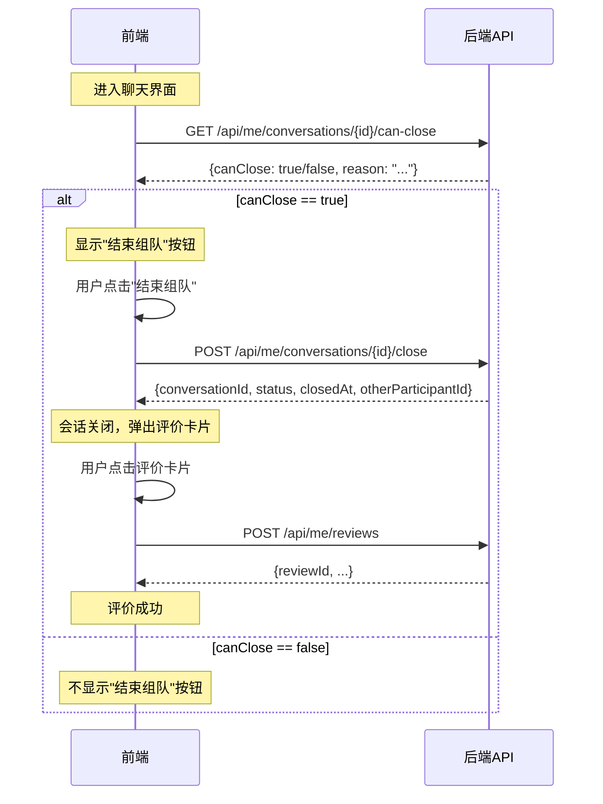
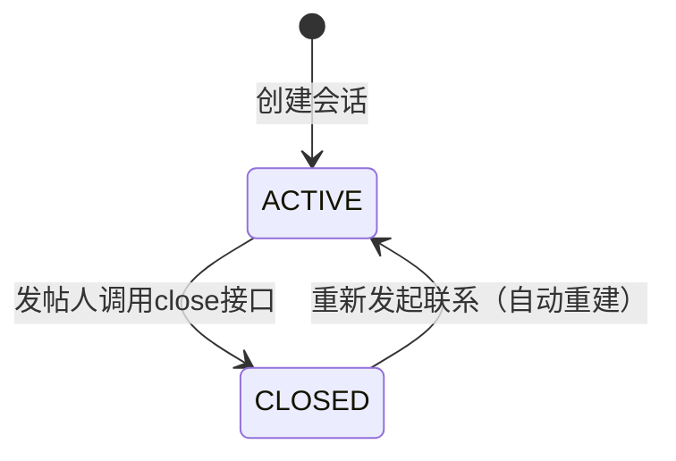

# 结束组队功能 API 文档

## 1. 功能概述

结束组队功能允许发帖人（帖子发布者）在聊天界面中结束组队会话。会话结束后：
- 双方无法继续发送消息
- 前端弹出评价卡片，引导用户进行互评

## 2. 接口列表

### 2.1 检查是否可结束组队

| 属性 | 值 |
|------|-----|
| **路径** | `GET /api/me/conversations/{conversationId}/can-close` |
| **认证** | JWT Token |
| **所属文件** | `ContactConversationController.java` |

#### 请求参数

| 参数 | 类型 | 位置 | 必填 | 说明 |
|------|------|------|------|------|
| conversationId | Long | Path | 是 | 会话ID |

#### 成功响应 (200 OK)

```json
{
  "canClose": true,
  "reason": "OK"
}
```

| 字段 | 类型 | 说明 |
|------|------|------|
| canClose | boolean | 是否可以结束组队 |
| reason | string | 原因说明 |

#### reason 枚举值

| 值 | 说明 |
|----|------|
| OK | 可以结束组队 |
| NOT_PARTICIPANT | 当前用户不是会话参与者 |
| ALREADY_CLOSED | 会话已关闭 |
| NO_RELATED_POST | 会话没有关联帖子 |
| NOT_POST_PUBLISHER | 当前用户不是帖子发布者 |
| POST_NOT_FOUND | 关联帖子不存在 |

---

### 2.2 结束组队

| 属性 | 值 |
|------|-----|
| **路径** | `POST /api/me/conversations/{conversationId}/close` |
| **认证** | JWT Token |
| **所属文件** | `ContactConversationController.java` |

#### 请求参数

| 参数 | 类型 | 位置 | 必填 | 说明 |
|------|------|------|------|------|
| conversationId | Long | Path | 是 | 会话ID |

#### 成功响应 (200 OK)

```json
{
  "conversationId": 123,
  "status": "CLOSED",
  "closedAt": "2026-06-16T10:30:00Z",
  "otherParticipantId": "550e8400-e29b-41d4-a716-446655440000"
}
```

| 字段 | 类型 | 说明 |
|------|------|------|
| conversationId | Long | 会话ID |
| status | string | 会话状态（CLOSED） |
| closedAt | string | 关闭时间（ISO 8601格式） |
| otherParticipantId | string | 对方参与者UUID（用于创建评价） |

#### 错误响应

| HTTP状态码 | 错误码 | 说明 |
|------------|--------|------|
| 404 | CONVERSATION_NOT_FOUND | 会话不存在 |
| 403 | NOT_PARTICIPANT | 当前用户不是会话参与者 |
| 403 | NO_RELATED_POST | 会话没有关联帖子 |
| 403 | NOT_POST_PUBLISHER | 当前用户不是帖子发布者 |
| 404 | POST_NOT_FOUND | 关联帖子不存在 |

---

### 2.3 创建评价（关联接口）

| 属性 | 值 |
|------|-----|
| **路径** | `POST /api/me/reviews` |
| **认证** | JWT Token |
| **所属文件** | `ReviewController.java` |

#### 请求体

```json
{
  "conversationId": 123,
  "revieweeId": "550e8400-e29b-41d4-a716-446655440000",
  "rating": 5,
  "reviewTags": ["守时", "沟通顺畅"]
}
```

| 字段 | 类型 | 必填 | 说明 |
|------|------|------|------|
| conversationId | Long | 是 | 会话ID |
| revieweeId | UUID | 是 | 被评价者ID（从close接口获取） |
| rating | int | 是 | 评分（1-5分，解锁联系方式后可评6分） |
| reviewTags | List<String> | 否 | 评价标签（预设值） |

#### 预设评价标签

| 类型 | 标签 |
|------|------|
| 正面 | 守时、沟通顺畅、配合度高、认真负责、体验很好 |
| 负面 | 迟到、失联、临时变卦、配合度低、体验不佳 |

#### 成功响应 (201 Created)

```json
{
  "id": 456,
  "conversationId": 123,
  "reviewerId": "550e8400-e29b-41d4-a716-446655441111",
  "revieweeId": "550e8400-e29b-41d4-a716-446655440000",
  "rating": 5,
  "reviewTags": ["守时", "沟通顺畅"],
  "status": "ACTIVE",
  "modifiedOnce": false,
  "createdAt": "2026-06-16T10:35:00Z",
  "updatedAt": "2026-06-16T10:35:00Z"
}
```

---

## 3. 前端调用流程



---

## 4. 业务规则

### 4.1 权限规则

| 角色 | 权限 |
|------|------|
| 帖子发布者 | 可以结束组队 |
| 帖子响应者 | 不可以结束组队 |
| 非参与者 | 无任何权限 |

### 4.2 会话状态流转



### 4.3 消息发送限制

会话状态为 `CLOSED` 时，调用发送消息接口会返回错误：

```http
POST /api/me/conversations/{conversationId}/messages
```

**错误响应**：
```json
{
  "errorCode": "CONVERSATION_CLOSED",
  "message": "Conversation is closed",
  "timestamp": "2026-06-16T10:30:00Z"
}
```

---

## 5. 数据库变更

### 5.1 新增字段（conversation 表）

| 字段名 | 类型 | 约束 | 说明 |
|--------|------|------|------|
| closer_id | UUID | 外键引用 user_account(id) | 关闭会话的用户ID |
| closed_at | TIMESTAMP WITH TIME ZONE | - | 会话关闭时间 |

### 5.2 迁移脚本位置

```
backend/src/main/resources/db/migration/V12__add_conversation_close_fields.sql
```

---

## 6. 错误码汇总

| 错误码 | HTTP状态码 | 说明 |
|--------|------------|------|
| CONVERSATION_NOT_FOUND | 404 | 会话不存在 |
| NOT_PARTICIPANT | 403 | 当前用户不是会话参与者 |
| NO_RELATED_POST | 403 | 会话没有关联帖子 |
| NOT_POST_PUBLISHER | 403 | 当前用户不是帖子发布者 |
| POST_NOT_FOUND | 404 | 关联帖子不存在 |
| CONVERSATION_CLOSED | 403 | 会话已关闭（发送消息时） |

---

## 7. 示例代码

### 7.1 检查是否可结束（JavaScript）

```javascript
async function checkCanClose(conversationId) {
  const response = await fetch(
    `/api/me/conversations/${conversationId}/can-close`,
    {
      method: 'GET',
      headers: {
        'Authorization': 'Bearer ' + localStorage.getItem('token'),
        'Content-Type': 'application/json'
      }
    }
  );
  return response.json();
}
```

### 7.2 结束组队（JavaScript）

```javascript
async function closeConversation(conversationId) {
  const response = await fetch(
    `/api/me/conversations/${conversationId}/close`,
    {
      method: 'POST',
      headers: {
        'Authorization': 'Bearer ' + localStorage.getItem('token'),
        'Content-Type': 'application/json'
      }
    }
  );
  return response.json();
}
```

### 7.3 创建评价（JavaScript）

```javascript
async function createReview(conversationId, revieweeId, rating, tags) {
  const response = await fetch('/api/me/reviews', {
    method: 'POST',
    headers: {
      'Authorization': 'Bearer ' + localStorage.getItem('token'),
      'Content-Type': 'application/json'
    },
    body: JSON.stringify({
      conversationId,
      revieweeId,
      rating,
      reviewTags: tags
    })
  });
  return response.json();
}
```

---

## 8. 安全注意事项

1. **身份验证**：所有接口均需要有效的 JWT Token
2. **权限校验**：只有帖子发布者可以结束组队
3. **会话关联**：必须验证会话与帖子的关联关系
4. **输入验证**：评分范围限制为 1-6 分，标签必须是预设值